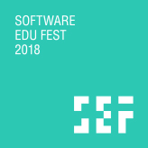

<h1 align="center">SEF 2018 Track B Presentation by Juneyoung Kang</h1>

## About SEF
네이버 커넥트재단이 주최, 2018년 8월 3일 ~ 4일 세종대학교 컨벤션센터에서 개최된 소프트웨어 교육 행사.  
초,중,고등학생, 학부모, 교사, 강사, 예비 교사대학생(SW비전공자) 등 대상으로 하며 참여 인원은 약 2000명.

## About Me
교하고등학교에 재학중인 고등학생 챗봇 개발자로, 이번 강의에서 커넥트재단으로부터 `어떻게 SW 개발을 공부를 시작하게 되었고 실제 어떻게 공부하였는지`에 대한 강연을 요청받았습니다.

## About Repository
본 레포지토리의 `/pt` 디렉토리에는 프레젠테이션 파일 `(SEF2018.pdf)`이 있으며, `script` 디렉토리에는 제가 전달하고자 했던 메세지에 대해 작성했습니다. 실제 강연내용과는 상이하지만, 주요 핵심 내용은 발표에서도 전달하였습니다. 마지막으로 `/video` 디렉토리에서는 본 강연의 전체 영상 파일`(part1.mp4, part2.mp4)`과 제 강연에 대한 요약 영상`(juneyoung.mp4)`이 있습니다.

## more...
추가적인 질문이나 연락은 아래로 부탁드립니다.  
[페이스북](facebook.com/juneyoungdev)
[이메일](mailto:juneyoungdev@gmail.com)